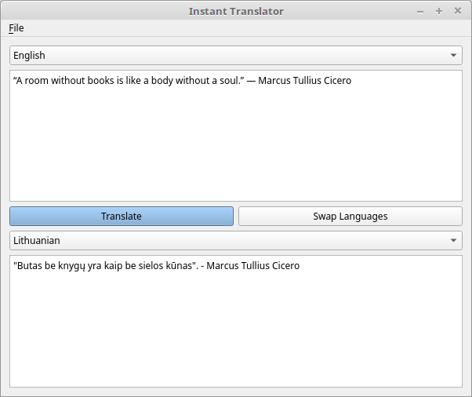

# instant-translator
[](https://travis-ci.org/ugnelis/instant-translator)
[](https://coveralls.io/github/ugnelis/instant-translator?branch=master)

Translate words and sentences instantly. Program uses APIs of various translators.

## What Does the App Solve?
### Context
Currently, I live in the country whose language I only know the basics.

### Problem
Most of the things are in local language. So, it is necessary to adapt quickly by searching for the meanings of the words or the sentences in various applications (WEB based, desktop based).

### Solution to the Problem
Desktop application that is able to translate the content of web pages and dekstop-based applications in the app by clicking on the desired button.

## Screenshot


## Supported APIs
* [Google Translate API](https://cloud.google.com/translate/)

## How to Use?
### Add API key
First of all, you need to get API key for desired API. Then put it in [src/resources/configs/api.ini](src/resources/configs/api.ini) file.
Example:
``` ini
[google]
key=AsjSAXXX
format=text
```

### Turn On Logs
In this project gflags library isn't used. That is why environment variable `GLOG_logtostderr` has to be set in order to see logs.
```bash
GLOG_logtostderr=1 ./instant_translator
```

### Translate by Pressing the Keyboard
Currently, it's made that when clipboard (copy or cut operation) is changed then the app translates the text.

## Minimum Software Requirements
* A desktop operating system that supports Qt.
* Qt 5.3+
* gcc 4.8+
