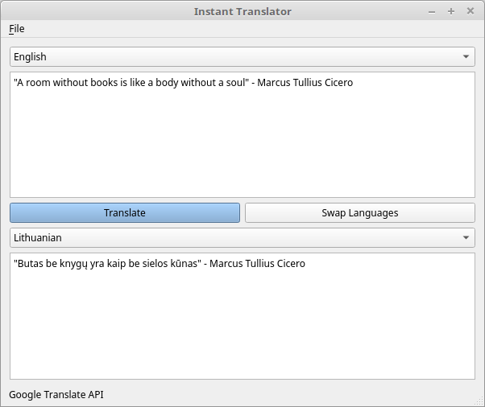

# instant-translator
Translate words and sentences instantly. Program uses various translator APIs.

## What the program solves?
### Context
I am a in the country whose language I know only the basics.

### Problem
Most things are in local language. It was necessary to quickly search words or sentences quickly, not only on the WEB pages but also in various dekstop applications.

### Solution to the Problem
I have made a desktop application that can translate both web pages and dekstop-based applications and translate that text into the program by clicking on the desired button.

## Screenshot


## Supported APIs
* [Google Translate API](https://cloud.google.com/translate/)

## How to Use?
### Add API key
First of all, you need to get API key for desired API. Then put it in [resources/configs/api.ini](server/resources/configs/api.ini) file.
Example:
``` ini
[google]
key=AsjSAXXX
format=text
```

### Translate by Pressing the Keyboard
Currently, it's made that when clipboard (copy or cut operation) is changed then the app translates the text.

## Minimum software requirements
* A desktop operating system that supports Qt.
* Qt 5.3+
* gcc 4.8+
